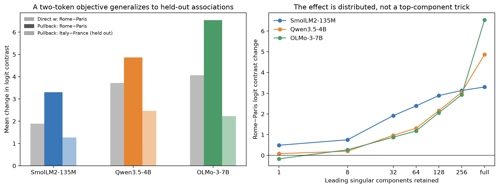
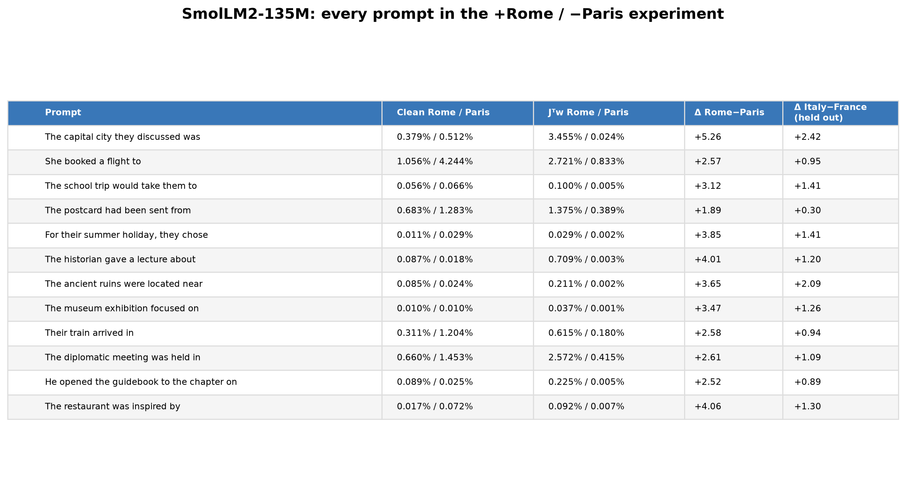
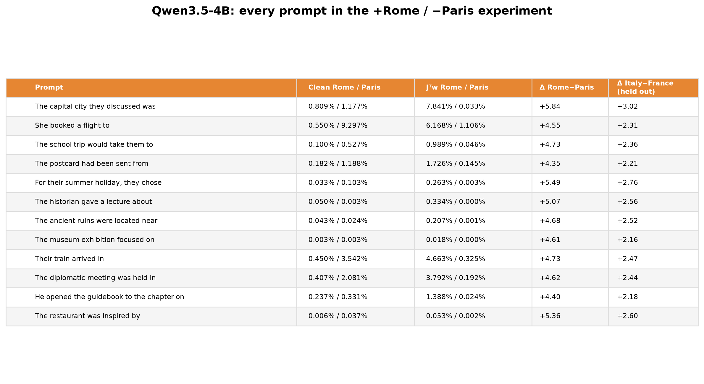
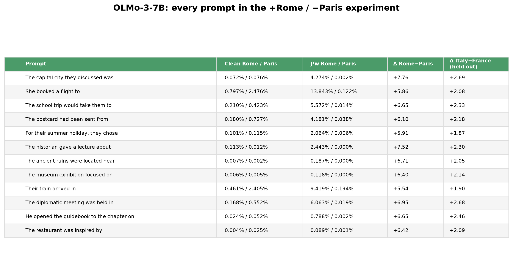

# From an artificial logit objective to a transported semantic contrast

## The short answer

We constructed exactly the target suggested in the question:

```text
increase the Rome logit by one unit
decrease the Paris logit by one unit
```

In vector form, before normalization,

```text
w = W_U[Rome] - W_U[Paris].
```

No Italy, France, Roman, French, or Vatican token was used to build `w`. We then
compared adding `w` directly at a middle layer with adding its J-Lens pullback

```text
v = J.T @ w.
```

The pullback produced a larger Rome-minus-Paris change than direct `w` in
SmolLM2-135M, Qwen3.5-4B, and OLMo-3-7B. It also moved a small, predeclared set
of held-out Italy-related tokens relative to France-related tokens in the same
direction. Reversing the pullback reversed both effects. The effect required
many singular components rather than the first one or eight.



This is promising evidence that a precisely specified output contrast can be
transported backward and can have broader associative effects. It is not yet a
clean proof that `J` discovered the abstract relation Italy-versus-France. The
unembedding geometry and ordinary residual computation already relate these
words, as shown by the nonzero direct-`w` result.

## 1. Correction: did we generalize single-token steering to concepts?

Only in a modest methodological sense.

The original paper defines a J-Lens direction for a vocabulary token `t`:

```text
v_t = J.T @ u_t,
```

where `u_t` is the token's unembedding row. But its spider/ant experiment is
already concept-level in the scientifically important sense. It identifies the
two directions, measures the current activation in their span, swaps the
coordinates, and changes the model's answer from the number of spider legs to
the number of ant legs. The intervention changes an intermediate concept used
by a computation; it is not merely a token-probability demo.

Our seven-concept experiment does this instead:

1. Begin with roughly 20 words such as `bread`, `cheese`, `soup`, and `salad`.
2. Keep spellings that tokenize as one token.
3. Split those tokens in half.
4. Average the normalized unembedding rows of the construction half to make
   `w`.
5. Compute `J.T @ w`.
6. Evaluate changes on the other half, which was not used in `w`, relative to
   matched control tokens.

So we did replace a one-token objective with a word-set objective and add a
held-out evaluation. That is a useful robustness protocol. However, “we
generalized token steering into concept steering” overstates novelty because:

- linearity makes `J.T @ w` a weighted sum of ordinary token J-Lens vectors;
- the original ant/spider result already manipulates concepts;
- a list of related words is only an operational proxy for a concept.

A safe application sentence is:

> I extended the evaluation from individual token directions to pre-specified
> word-set objectives, separating construction words from held-out evaluation
> words and comparing against direct residual and random controls.

## 2. What “prose-estimated pullback” means

This phrase sounds more mysterious than the computation is.

### Step 1: choose where the edit and outcome live

Suppose we edit the residual stream at layer `l` and examine a later target
layer `L`. For one prompt `x`, the model defines a local transport map:

```text
small change at layer l  ->  resulting small change at layer L.
```

The Jacobian `J(x)` is the matrix of derivatives describing this map near that
particular prompt. It is not an activation and it is not a trained probe.

### Step 2: choose a target outcome

For food steering, `w` points toward the construction food words in the target
residual space. For the new experiment, `w` is exactly the Rome unembedding row
minus the Paris row.

### Step 3: ask which earlier edit most increases that target locally

For one prompt, the answer is the gradient

```text
v(x) = J(x).T @ w.
```

This says: find an early-layer direction whose predicted downstream movement
has high dot product with `w`.

### Step 4: make one reusable direction

Instead of using a different direction for every prompt, we used 18 ordinary
prose passages as an estimation bank and averaged:

```text
v_prose = (1/18) * sum over prose x of [J(x).T @ w]
        = J_prose.T @ w,

where J_prose = (1/18) * sum over prose x of J(x).
```

That is all “prose-estimated pullback” means. Prose labels were not fitted. The
model was not fine-tuned. We did not average residual activations. We averaged
local derivative maps measured on prose contexts, applied their transpose to
the fixed target `w`, normalized the resulting direction, and added it to the
residual stream of separate evaluation prompts.

The word “prose” describes where the Jacobian estimate came from, not what the
direction was intended to mean. A prose-estimated food pullback and a
prose-estimated Rome-minus-Paris pullback use the same `J_prose` but different
targets `w`.

## 3. The new Rome-minus-Paris experiment

### Construction

For each tokenizer, both ` Rome` and ` Paris` are single tokens. Let their raw
unembedding rows be `u_R` and `u_P`. We set

```text
w = normalize(u_R - u_P).
```

Ignoring the model's final normalization for intuition, a final residual `h`
has contrast

```text
logit(Rome) - logit(Paris) = (u_R - u_P) dot h.
```

Thus this `w` is not a verbal interpretation or a direction found by looking at
results. It is an explicitly defined objective.

At a representative middle layer we compared equal-norm interventions:

- `direct_w`: add the same output contrast directly at the earlier layer;
- `pullback`: add `J.T @ w`;
- `reverse_pullback`: add `-J.T @ w`;
- top-`k`: retain only the first `k` singular contributions;
- random: add a seeded random direction.

All interventions use a length equal to 15% of that layer's typical residual
norm. The same 12 prompts are used in all three models.

### Aggregate result

| Model and layer | Direct `w`: Rome−Paris | Pullback: Rome−Paris | Reverse pullback | Pullback: held-out Italy−France |
|---|---:|---:|---:|---:|
| SmolLM2-135M, L20 | +1.893 | **+3.301** | −2.790 | +1.271 |
| Qwen3.5-4B, L21 | +3.722 | **+4.868** | −4.364 | +2.466 |
| OLMo-3-7B, L22 | +4.069 | **+6.539** | −6.531 | +2.232 |

The reported numbers are changes in logit differences, averaged across prompts.
For example, `+6.539` means the intervention changed
`logit(Rome)-logit(Paris)` by 6.539 logits relative to the clean run. It does not
mean Rome's probability rose by 653.9%; probabilities are normalized against
the whole vocabulary and vary by prompt.

The held-out exploratory contrast averages available single-token spellings of
`Italy`, `Italian`, `Roman`, and `Vatican`, then subtracts the corresponding
average for `France` and `French`. Tokenization excluded several proposed words,
so this is a small word set and should not be presented as a definitive semantic
benchmark.

### Do language, people, and other places move too?

We subsequently split the associations into categories. This is an exploratory
follow-up performed after seeing the aggregate association result, not a
preregistered confirmatory test. The table reports the mean change in each
positive-minus-negative logit contrast under `J.T @ w`:

| Held-out category | SmolLM | Qwen 4B | OLMo 7B |
|---|---:|---:|---:|
| Country: Italy − France | +0.869 | +2.265 | +1.933 |
| Language/people: Italian, Italians, Romans − French | +1.357 | +2.546 | +2.268 |
| Other cities: Italian-city mean − French-city mean | +0.369 | +1.049 | +0.721 |
| Unrelated control: Japan/Tokyo − China/Beijing | −0.013 | −0.260 | −0.110 |
| Unrelated control: Spain/Madrid − Germany/Berlin | +0.109 | +0.268 | +0.193 |

The country and language/people contrasts were positive on all 12 prompts in
all three models. The other-city contrast was positive on 9/12 SmolLM prompts
and 12/12 prompts in both larger models. Reversing the pullback reversed the
country and language/people contrasts on all prompts.

This supports a real broader associative change: a target built only from
`Rome` and `Paris` also changes `Italy` versus `France`, national/language words,
and cities such as Milan/Venice/Naples/Florence relative to
Lyon/Marseille/Bordeaux/Nice. The much smaller unrelated controls argue against
a completely generic geographic shift. But specificity is not perfect:
Spain-versus-Germany moves slightly in the same direction, and the direct `w`
baseline already changes the related categories substantially.

The language and people category cannot fully separate those two meanings
because `Italian` and `French` are both language names and demonyms. `Parisians`
was not a single token in these tokenizers. Likewise, the landmark comparison
retained too few comparable single-token words, and the French food candidates
were split into multiple tokens. Those categories require sequence-level
scoring rather than silently discarding inconvenient words.

### Prompt examples

For OLMo-3-7B:

| Prompt | Clean Rome / Paris | Pullback Rome / Paris | Contrast change |
|---|---:|---:|---:|
| She booked a flight to | 0.797% / 2.476% | 13.843% / 0.122% | +5.86 |
| Their train arrived in | 0.461% / 2.405% | 9.419% / 0.194% | +5.54 |
| The capital city they discussed was | 0.072% / 0.076% | 4.274% / 0.002% | +7.76 |
| The diplomatic meeting was held in | 0.168% / 0.552% | 6.063% / 0.019% | +6.95 |
| The historian gave a lecture about | 0.113% / 0.012% | 2.443% / <0.001% | +7.52 |

Every prompt, including low-base-rate cases, is shown here:

- 
- 
- 

The full machine-readable top-eight distributions are in
`out/rare/smollm_rome_paris.json`, `out/rare/qwen35_4b_rome_paris.json`, and
`out/rare/olmo3_7b_rome_paris.json`.

### Factual-relation stress test: “The Eiffel Tower is located in …”

We then deliberately supplied facts that favor one side of the contrast. This
distinguishes raising associated vocabulary from coherently replacing a bound
entity in a factual relation. The result is a useful negative.

For `The Eiffel Tower is located in`:

| Model | Clean Rome / Paris | Pullback Rome / Paris | Top clean → pullback |
|---|---:|---:|---|
| SmolLM | 0.014% / 57.054% | 6.113% / 11.691% | Paris → the |
| Qwen 4B | 0.003% / 34.612% | 0.202% / 14.987% | Paris → which |
| OLMo 7B | 0.007% / 9.482% | 0.891% / 1.352% | which → which |

The pullback strongly suppresses Paris and raises Rome, but it does not make
Rome the top answer in any model. It damages or weakens the correct fact rather
than cleanly rewriting Eiffel-Tower-in-Paris to Eiffel-Tower-in-Rome.

For `The capital of France is`, the Rome-versus-Paris pair flips in SmolLM
(1.650% versus 1.346%) and OLMo (4.632% versus 0.482%), but an intervening
grammar token remains top. Qwen still prefers Paris (25.141%) to Rome (13.669%).
This again shows strong movement of the requested coordinate without a robust,
clean answer replacement.

The clearest failure of a broad concept-swap story is language. On `The most
widely spoken language in Paris is`, all three clean models answer `French`, and
all three still answer `French` under the Rome pullback. The Italian probability
rises, but only to 0.957% in SmolLM, 0.237% in Qwen, and 0.135% in OLMo, while
French remains between 40.7% and 71.7%.

The intervention more reliably reinforces already-consistent facts. It makes
`Rome` top for `The capital of Italy is` in all three models and makes `Rome`
top for `The Colosseum is located in` in OLMo. Conversely, the negative
pullback substantially raises Paris on the Colosseum prompt and can flip the
Rome/Paris pair, but often still fails to produce Paris as the top continuation.

Therefore the evidence supports:

> `J.T @ (Rome - Paris)` is a powerful, bidirectional logit/association control,
> but it is not a reliable relational entity swap. Factual binding supplied by
> the prompt can resist the edit, and a large pairwise logit change need not
> become a coherent counterfactual answer.

This is directly relevant to the original ant/spider comparison. Their
two-coordinate state-dependent swap edits the activation already present in the
prompt. Our fixed additive direction is context-independent at application
time. A fair next experiment would measure the prompt's Rome/Paris coordinates
and swap them, rather than adding the same Rome-minus-Paris vector everywhere.

Full factual outputs are saved in `out/rare/smollm_rome_paris_facts.json`,
`out/rare/qwen35_4b_rome_paris_facts.json`, and
`out/rare/olmo3_7b_rome_paris_facts.json`.

## 4. What SVD contributes

Write the Jacobian as

```text
J = U Sigma V.T.
```

Then

```text
J.T @ w = sum_i sigma_i * (u_i dot w) * v_i.
```

Each term has a clear role:

- `u_i dot w`: how much target-side singular direction `u_i` aligns with the
  requested Rome-minus-Paris outcome;
- `sigma_i`: how strongly that component is transported between layers;
- `v_i`: the early-layer direction that produces that downstream component.

This lets us remove all but the first `k` terms and rerun the causal edit.

| k | SmolLM | Qwen 4B | OLMo 7B |
|---:|---:|---:|---:|
| 1 | +0.490 | +0.082 | −0.165 |
| 8 | +0.753 | +0.202 | +0.271 |
| 32 | +1.918 | +0.965 | +0.877 |
| 64 | +2.385 | +1.307 | +1.178 |
| 128 | +2.888 | +2.159 | +2.061 |
| 256 | +3.129 | +3.047 | +2.925 |
| Full pullback | **+3.301** | **+4.868** | **+6.539** |

The finite-`k` decompositions for Qwen and OLMo use seeded randomized low-rank
SVD; the full endpoint is exact `J.T @ w`. The conclusion is consistent with
the earlier seven-concept rank experiment: the useful effect is distributed.
The leading singular vector is not “the Rome direction,” and the first eight
components are nowhere near sufficient in the larger models.

SVD is therefore useful here for a mechanistic negative result: it rules out the
tempting story that transport works because one top, easily named component
carries the contrast. It also provides an efficiency curve—how much causal
effect is retained at a chosen rank. It does not automatically interpret the
components.

## 5. What this experiment does and does not establish

It establishes, on this fixed prompt set:

- an exact two-token output objective can be transported to an earlier layer;
- the transported direction beats adding the output direction directly in all
  three models;
- the effect is bidirectional;
- all 12 prompts move in the intended direction in every model;
- associated, construction-held-out geography words also move consistently;
- the causal effect is spread across many singular components.

It does not establish:

- coherent multi-token generations about Rome or Italy;
- that `J` rather than the unembedding geometry created the semantic relation;
- selectivity against many unrelated cities and countries;
- robustness over multiple city pairs, prompt banks, layers, or doses;
- a novel steering algorithm beyond J-Lens.

The cleanest follow-up is a registered family of contrasts—Rome/Paris,
Tokyo/Beijing, cats/dogs, positive/negative sentiment—with relation words held
out. Residualize each two-token target against its held-out relation vector, add
unrelated-pair controls, and score multi-token generations. That would separate
“the output embeddings were already semantically nearby” from “transport through
the model reconstructs a broader relation.”

## 6. Reproduction

The implementation is `jlens/contrastive_logit_steering.py`; figures are made by
`jlens/contrastive_logit_figs.py`. The experiment uses cached models and saved
lenses and does not fit parameters or select prompts based on the result.
